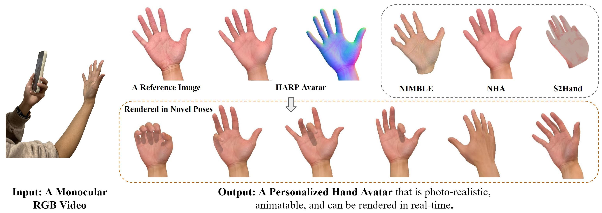

# HARP: Personalized Hand Reconstruction from a Monocular RGB Video
**CVPR 2023**

### Korrawe Karunratanakul, Sergey Prokudin, Otmar Hilliges, Siyu Tang <br/>  ETH Zurich



[](https://korrawe.github.io/harp-project/)
[](https://arxiv.org/abs/2212.09530)

<!-- Video: [Youtube](http://www.youtube.com/watch?feature=player_embedded&v=QBiAN8Bobuc) <br/> -->

## Updates

- June 20, 2023: Initial release with sample preprocessed data.
- July 3, 2023: How to process new video. Added all preprocessed data from subject one.

# Running the code
## Dependencies
- ```requirements.txt``` or ```requirements_reduce.txt```
- [MANO model](https://github.com/hassony2/manopth) for hand only model
- [SMPLX model](https://smpl-x.is.tue.mpg.de/) for hand and arm model
- [Mesh Transformer](https://github.com/microsoft/MeshTransformer) for initial hand mesh prediction on new videos

The easiest way to run the code is to use [conda](https://docs.conda.io/en/latest/miniconda.html).

The code is tested on Ubuntu 20.04 with python 3.8 and 3.9.

<details>
  <summary>Installation with python 3.9</summary>

  1. Create a conda env with python 3.9: <p>
      ```
      conda create -n harp python=3.9 && conda activate harp
      ```
  2. Install requirements for pytorch3d version 0.6.2: <p>
     ```
     conda install pytorch==1.11.0 torchvision==0.12.0 cudatoolkit=11.3 -c pytorch
     conda install -c fvcore -c iopath -c conda-forge fvcore iopath
     ```
  3. Install pytorch3d version 0.6.2: <p>
      ```
      conda install pytorch3d=0.6.2 -c pytorch3d
      ```
  4. Install other packages: <p>
     ```
     pip install -r requirements_reduce.txt
     ```

  For other version of python and pytorch, check a good summary from mJones00 [here](https://github.com/korrawe/harp/issues/2).
</details>

<b>NOTE</b>: As the python requirements for Mesh Transformer and pytorch3D are different, they need to be installed in separate conda environments.

### Hand models
- Download smplx and put it in ``` ./hand_models/```.
- Replace ```./hand_models/smplx/smplx/body_models.py``` and ```./hand_models/smplx/smplx/__init__.py``` with our version in ```./hand_models_harp/```.
- Download MANO and put it in the root directory ``` ./mano/``` and ``` ./manopth/```.


## Avatar from preprocessed video
<!--  -->
### Preprocessed sequence
- Download the sample preprocessed sequence from [here](https://drive.google.com/file/d/1KLMvehpEAXR8lkjHHX4q4E6mgAHOTwM3/view?usp=sharing)
- Put the data in ```../data/```. The path can be changed in ```utils/config_utils.py```.
- Released data (from one subject, with different appearance variations) can be found [here](https://polybox.ethz.ch/index.php/s/EDvgrNXiOLNyPYp)

### Running the optimization
To start optimizing the sequence from the coarse initialization, run:
```
python optmize_sequence.py
```

The output images are in the ```exp``` folder as set in ```config_utils.py```. 

## Processing new video
<details>
  <summary>MeshTransformer Installation</summary>

  1. Install MeshTransformer following their [repo](https://github.com/microsoft/MeshTransformer)
  2. Copy the following files in ```./metro_modifications``` and replace the files in ```./MeshTransformer/metro```:
     ```
     ./MeshTransformer/metro/tools/end2end_inference_handmesh.py
     ./MeshTransformer/metro/hand_utils/hand_utils.py
     ./MeshTransformer/metro/utils/renderer.py
     ```
  3. Set the ```SMPLX_PATH``` in [end2end_inference_handmesh.py](https://github.com/korrawe/harp/blob/master/metro_modifications/end2end_inference_handmesh.py#L40)
  4. Set the new sequence path at [L150](https://github.com/korrawe/harp/blob/master/metro_modifications/end2end_inference_handmesh.py#L150): <p>

</details>

## Segmentation and fitting
- Get the hand segmentation mask using [Unscreen](https://www.unscreen.com/) or [RVM](https://peterl1n.github.io/RobustVideoMatting/) or any other tool. We used RVM for the sample sequence from InterHand2.6M and Unscreen in other cases.
- Put them in the same structure as in the sample sequence.
- For output from Unscreen, you can download the ```.gif``` file then use ```ffmpeg``` to split the video into frames.
  ```
  SEQ=name
  mkdir ${SEQ}
  mkdir ${SEQ}/image
  mkdir ${SEQ}/unscreen
  ffmpeg -i ${SEQ}.mp4 -vf fps=30 ${SEQ}/image/%04d.png
  ffmpeg -i ${SEQ}.gif -vsync 0 ${SEQ}/unscreen/%04d.png
  ```
  - The ```end2end_inference_handmesh``` has the option to convert empty background from Unscreen into white background with the flag ```--do_crop```.
- Run METRO to get the initial hand mesh
  ```
  python ./metro/tools/end2end_inference_handmesh.py --resume_checkpoint ./models/metro_release/metro_hand_state_dict.bin --image_file_or_path PATH --do_crop
  ```
- (Run by default) Fit the hand model to METRO output. This step is needed as METRO only predicts the vertex locations. 
- Change the path in ```utils/config_utils.py``` and run ```python optmize_sequence.py```.

# BibTex
```
@inproceedings{karunratanakul2023harp,
  author    = {Karunratanakul, Korrawe and Prokudin, Sergey and Hilliges, Otmar and Tang, Siyu},
  title     = {HARP: Personalized Hand Reconstruction from a Monocular RGB Video},
  booktitle = {IEEE/CVF Conference on Computer Vision and Pattern Recognition (CVPR)},
  year      = {2023},
}
```


# Code References

Parts of the code are based on the following repositories. Please consider citing them in the relevant context:

- The ```body_models``` is built on top of the base class from [SMPLX](https://smpl-x.is.tue.mpg.de/) which falls under their license.
- The renderer are based on the renderer from [Pytorch3D](https://pytorch3d.org/).
- The MANO model implementation from Yana Hasson.
- The hand fitting code from [Grasping Field](https://github.com/korrawe/grasping_field).


<!-- # Acknowledgement

We  sincerely  acknowledge . -->


